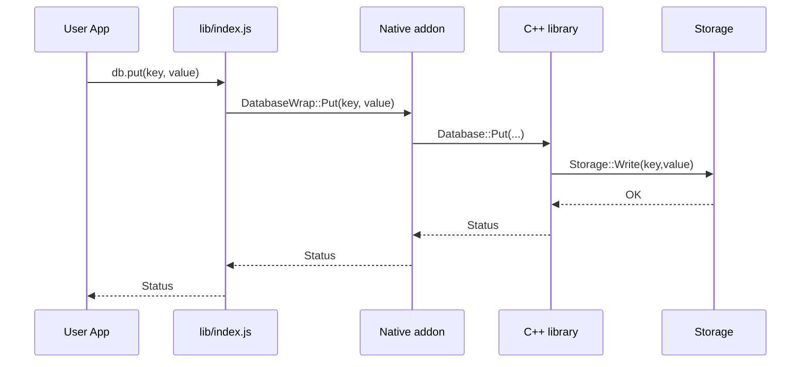

<!--
GITHUB_README.md
Purpose: Provide a GitHub-friendly, color/badge/diagram-rich top-level README that links to chapter files.
-->

# local_indexed_db — Integration Guide (GitHub)

[](./START_HERE.md) [](https://nodejs.org/) []() [](../LICENSE)

A friendly, visual guide to integrating the portable local-indexed-db module into Node.js projects. This file is designed for GitHub: it contains a clear table of contents, chapter links to the existing markdown files in this folder, Mermaid diagrams, sample code blocks, and quick start commands.

---

## Table of Contents (Chapters)

- [Start Here (Overview)](./START_HERE.md)
- [Quick Start](./QUICKSTART.md)
- [Setup & Build](./SETUP.md)
- [API Reference & Examples](./README.md)
- [Troubleshooting & FAQ](./TROUBLESHOOTING.md)
- [Project Index & Navigation](./INDEX.md)
- [File Structure](./FILE_STRUCTURE.md)
- [Project Summary](./PROJECT_SUMMARY.md)
- [Examples Directory]
  - [`example.js`](./example.js) — comprehensive demo
  - [`sample-write.js`](./sample-write.js) — file-backed write demo
  - [`sample-read.js`](./sample-read.js) — file-backed read demo
  - [`file_db.js`](./file_db.js) — JSON atomic file store (demo helper)

---

## Quick Visual Architecture

```mermaid
flowchart LR
  subgraph JS [JavaScript Layer]
    A[App] --> B[`lib/index.js`]
  end
  subgraph Native [Native Layer]
    B --> C[`local_indexed_db_native.node`]
    C --> D[Portable C++ Library]
  end
  subgraph Storage [Storage]
    D -->|abstracts| E{IStorage}
    E --> F[InMemoryStorage]
    E --> G[File-backed (demo: file_db.js)]
    E --> H[LevelDB/RocksDB (prod)]
  end
  style JS fill:#f3f9ff,stroke:#0366d6
  style Native fill:#fff6f0,stroke:#d73a49
  style Storage fill:#f0fff4,stroke:#22863a
```

> Colors: GitHub will render the Mermaid diagram in supported viewers. The `style` lines add subtle colors for readability.

---

## Quick Start Commands (Copyable)

```bash
# Run the demo file-backed example (no native build required)
cd nodejs
node sample-write.js
node sample-read.js

# If you want to use the native binding (recommended for performance)
cd nodejs
npm install
npm run build
npm test
node example.js
```

---

## Example: Write and Read (file-backed) — explained

This example shows the quick pattern used by `sample-write.js` and `sample-read.js` which rely on `file_db.js` (a small atomic JSON-backed store). It is ideal for teaching and demos.

```javascript
// write-sample (write to 'sample-index.db')
const FileDB = require('./file_db');
const db = new FileDB('sample-index.db');

db.put('user:1', JSON.stringify({ id: 1, name: 'Alice' }));
db.put('user:2', JSON.stringify({ id: 2, name: 'Bob' }));
console.log('Wrote users -> sample-index.db');
```

```javascript
// read-sample
const FileDB = require('./file_db');
const db = new FileDB('sample-index.db');

const keys = db.keys();
for (const k of keys) {
  let v = db.get(k);
  try { v = JSON.parse(v); } catch (e) { }
  console.log(k, '=>', v);
}
```

This shows the entire data lifecycle: write JSON-serialized values, then read and parse them back for use in your Node app.

---

## Example: Using Native Binding (synchronous API)

The native addon provides a simple synchronous API via the JS wrapper. Example:

```javascript
const { Database, IDBKey, Encoding, Status } = require('./lib/index.js');
const db = new Database();

// Put / Get
const status = db.put('user:1', JSON.stringify({ id:1, name:'Alice' }));
if (Status.isOk(status)) console.log('Put OK');

const res = db.get('user:1');
if (Status.isOk(res)) console.log('Got:', JSON.parse(res.value));

// Batch example
const batch = new db.WriteBatch();
batch.put('a', '1');
batch.put('b', '2');
const s = db.commitBatch(batch);
console.log('Batch commit:', s === Status.OK ? 'OK' : 'FAILED');
```

> Note: The `WriteBatch`/`commitBatch` shape depends on the JS wrapper — see `lib/index.js` and `nodejs/README.md` chapters for the exact API in this repo.

---

## Diagrams: Sequence (Put flow)



---

## Links & References

- Module docs (this folder): see the chapter links at the top
- Portable C++ library: `../portable/`
- IndexedDB spec: https://w3c.github.io/IndexedDB/
- NaN (Node native addons helper): https://github.com/nodejs/nan

---

## Chapters & Suggested Reading Path

1. `START_HERE.md` — 5-minute orientation and first steps
2. `QUICKSTART.md` — hands-on quickstart
3. `README.md` — in-depth API reference & examples
4. `SETUP.md` — build & environment setup
5. `TROUBLESHOOTING.md` — common errors and fixes
6. `INDEX.md` — documentation index
7. `FILE_STRUCTURE.md` — what files are where
8. `PROJECT_SUMMARY.md` — high-level project status

---

## Contributing & Next Steps

- Add CI (GitHub Actions) to run `npm test` and publish build artifacts.
- Add TypeScript declarations for `lib/index.js` so consumers get autocompletion.
- Implement a LevelDB-backed `IStorage` and expose an option to the JS wrapper.

---

If you want, I can:

- Add a small GitHub Actions workflow file that runs `npm test` and reports a status badge.
- Add `index.d.ts` TypeScript definitions and place them in the package.
- Convert `file_db.js` demo into a production-ready LevelDB-backed Node module (larger task).

---

*Created on December 6, 2025 — nodejs integration guide.*
